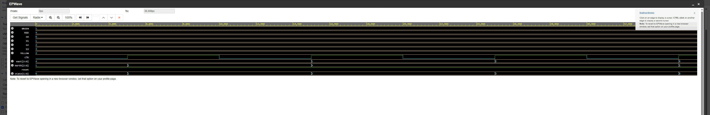
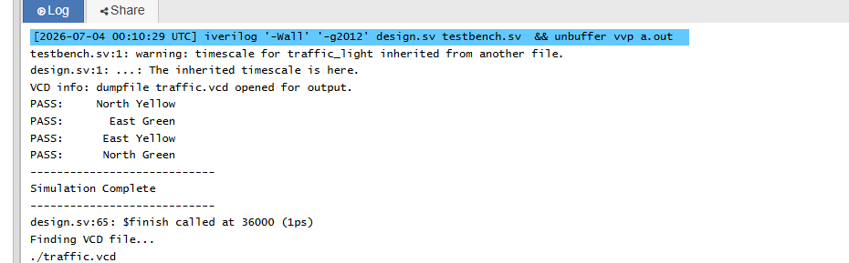

# 🚦 Traffic Light Controller (Finite State Machine)

## Overview

This project implements a four-way traffic light controller using a Finite State Machine (FSM) in Verilog HDL.

The controller cycles through four traffic states:

- North/South Green
- North/South Yellow
- East/West Green
- East/West Yellow

The project demonstrates sequential digital logic, state transitions, clocked processes, and hardware verification using a self-checking testbench.

---

## Features

- Finite State Machine (FSM)
- Clock-driven sequential logic
- Four traffic light states
- Reset functionality
- Self-checking Verilog testbench
- Waveform simulation

---

## State Diagram

```
        +----------------+
        | North Green    |
        | East Red       |
        +----------------+
                |
                v
        +----------------+
        | North Yellow   |
        | East Red       |
        +----------------+
                |
                v
        +----------------+
        | North Red      |
        | East Green     |
        +----------------+
                |
                v
        +----------------+
        | North Red      |
        | East Yellow    |
        +----------------+
                |
                +-------> Repeat
```

---

## State Table

| State | North | East |
|-------|-------|------|
| S0 | Green | Red |
| S1 | Yellow | Red |
| S2 | Red | Green |
| S3 | Red | Yellow |

---

## Project Files

```
traffic_light.v
traffic_light_tb.v
README.md
images/
```

---

## Waveform

[](waveform.png)

## Simulation Output

[](simulation_output.png)
---

## Tools Used

- Verilog HDL
- EDA Playground
- Icarus Verilog
- EPWave
- GitHub

---

## What I Learned

This project strengthened my understanding of:

- Finite State Machines
- Sequential Logic
- Clocked Hardware Design
- State Transitions
- Testbench Development
- Hardware Simulation

---

## Future Improvements

- Pedestrian crossing button
- Adjustable traffic timing
- Emergency vehicle priority
- Parameterized timing values
- FPGA deployment
